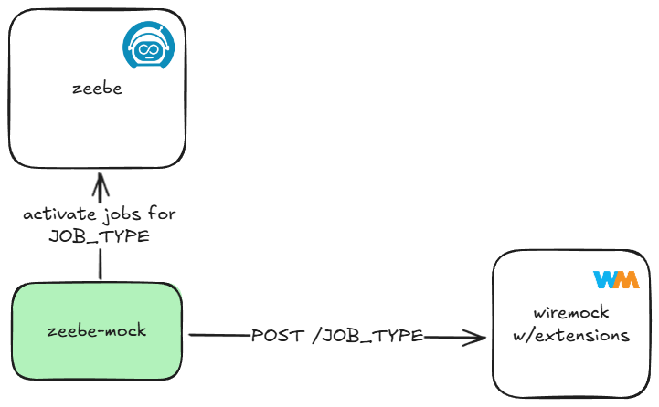

# zeebe-mock

treat zeebe workers as mockable endpoints

## documentation

[Check the wiki!](https://github.com/nhomble/zeebe-mock/wiki)

## examples

- [docker compose with zeebe play](./local/docker-compose.zeebe-play.yaml)

## artifacts

- [zeebe-mock image](https://hub.docker.com/r/hombro/zeebe-mock)
- [zeebe-mock-wiremock image](https://hub.docker.com/r/hombro/zeebe-mock-wiremock)